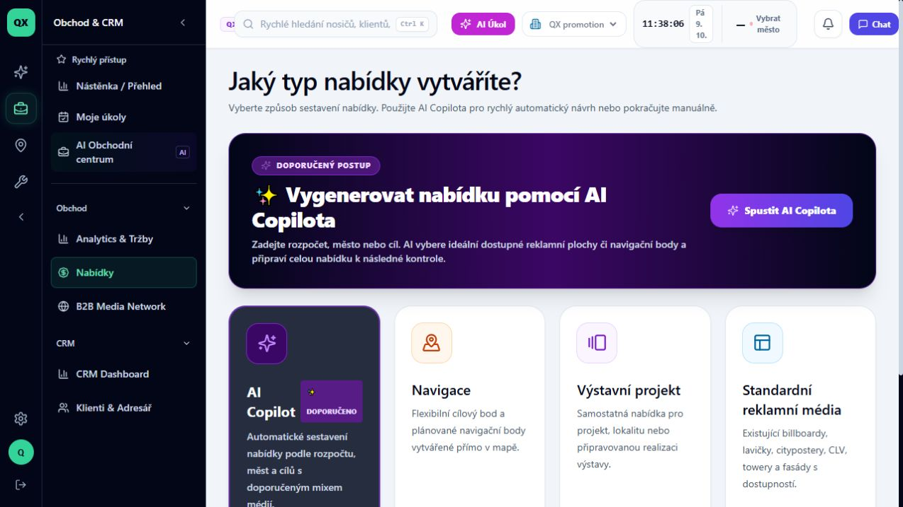
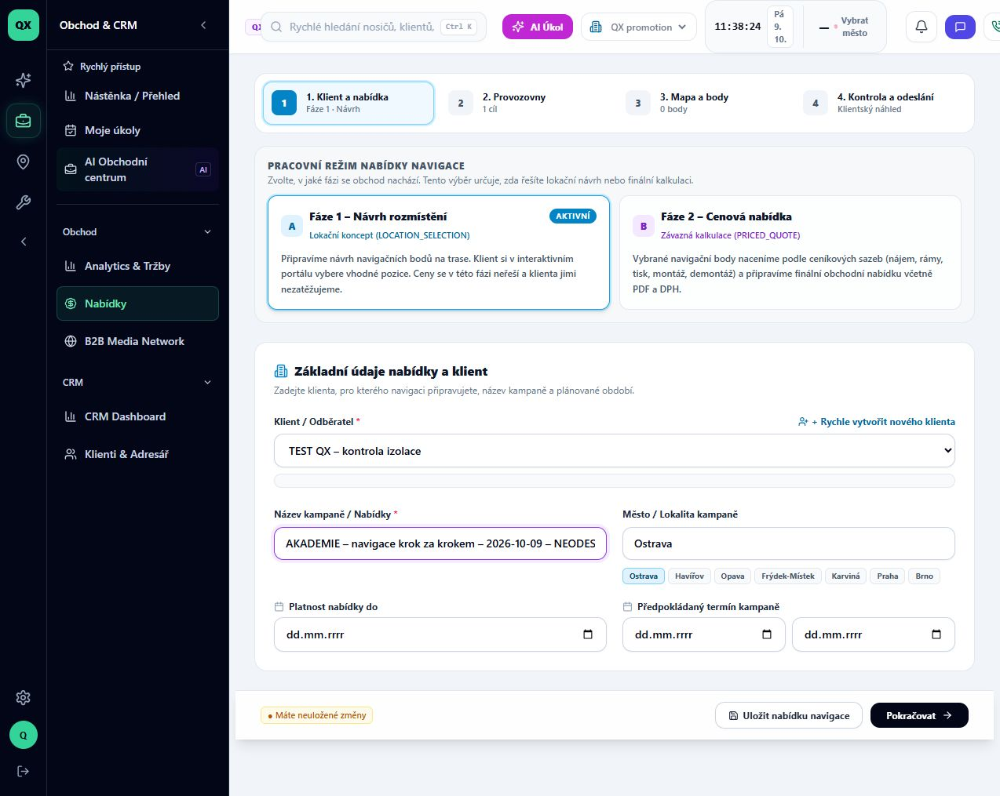
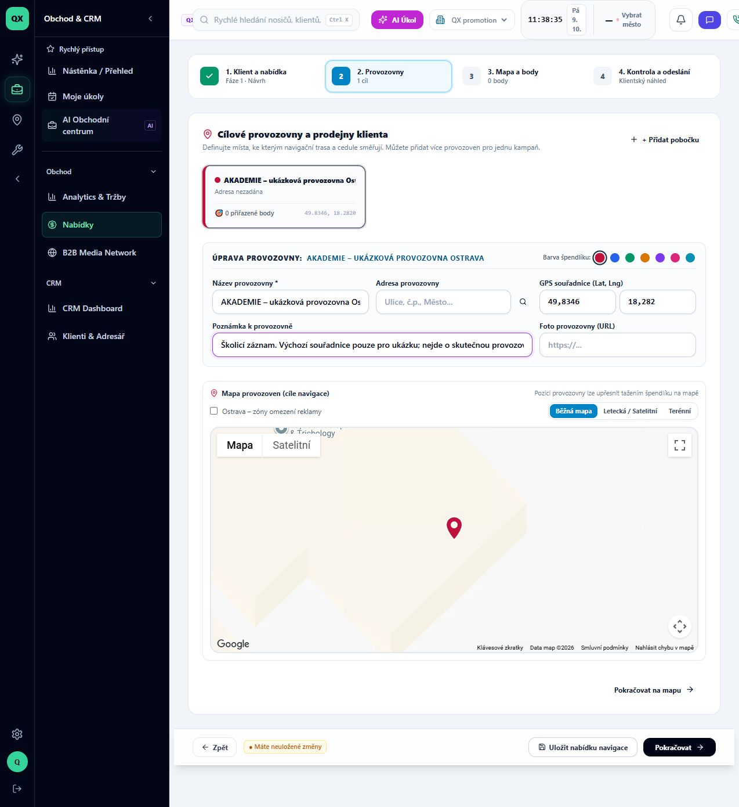
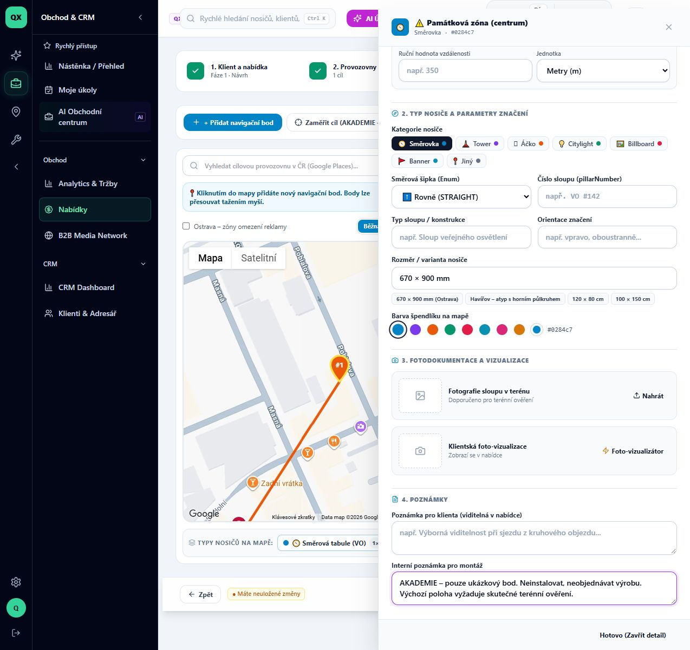
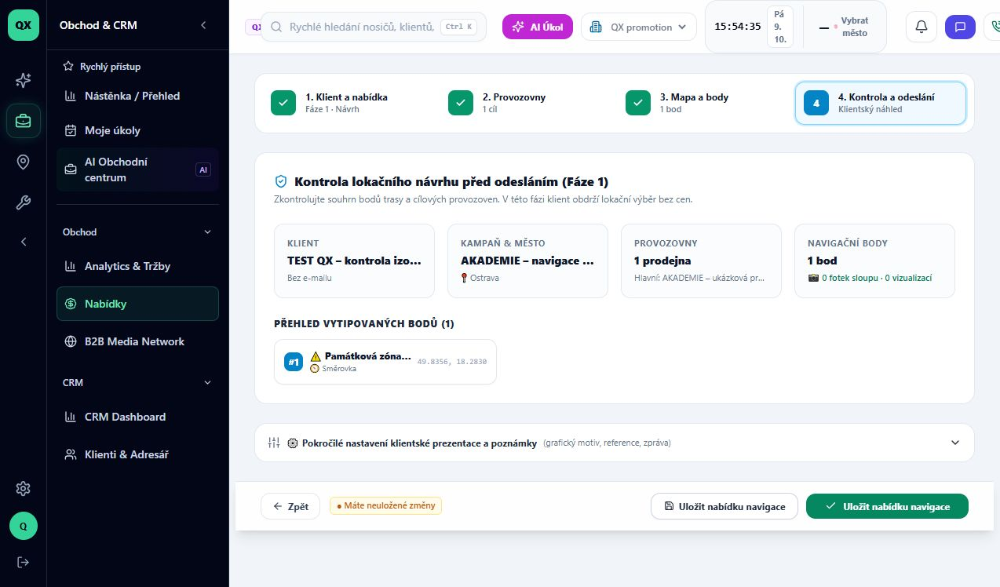
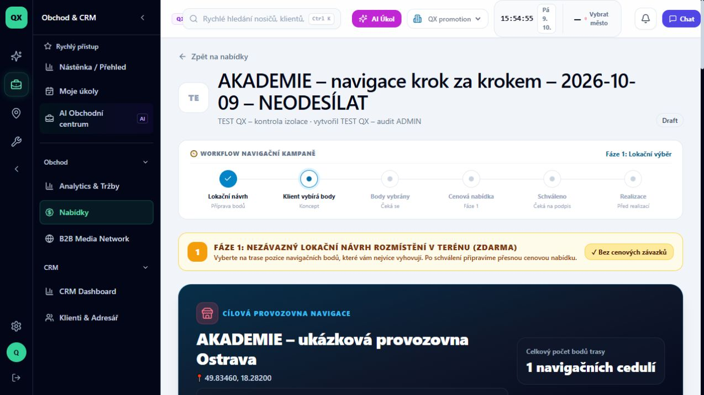

# Jak připravit a uložit první navigační návrh

Stav: VERIFIED. Ověřeno v běžící aplikaci 9. 10. 2026 v organizaci QX promotion, účtem TEST QX – audit ADMIN. Návod není publikovaný v Akademii. Rozsah: desktop, jedna provozovna, jeden bod, uložení konceptu a obnovení stránky. Odhad: 4 minuty.

Cíl: připravit nezávazný lokační návrh, ke kterému se můžete vrátit. Odeslání klientovi, jeho výběr, nacenění a realizace jsou samostatné lekce a tímto průchodem nejsou ověřené.

Předpoklady: přístup k Nabídkám a klient uložený v aktivní organizaci. Tento průchod využívá klienta „TEST QX – kontrola izolace“. Pro běžnou práci vyberte vlastního klienta. Stejný postup zatím nebyl samostatně odzkoušen rolí obchodníka ani na mobilu.

## 1. Otevřete nabídky

V levém sloupci otevřete **Obchod & CRM**, potom **Nabídky**. Na stránce Sales dashboard klikněte na **Nový návrh kampaně**. Otevře se výběr „Jaký typ nabídky vytváříte?“.

## 2. Vyberte navigaci

Klikněte na kartu **Navigace**, na které je text **Pokračovat manuálně**. Dostanete se do formuláře se čtyřmi kroky: Klient a nabídka, Provozovny, Mapa a body, Kontrola a odeslání.

## 3. Vyplňte klienta a název

Ponechte aktivní **Fáze 1 – Návrh rozmístění**. V poli **Klient / Odběratel** vyberte klienta. Do **Název kampaně / Nabídky** napište jednoznačný název. Zkontrolujte **Město / Lokalita kampaně** – v tomto průchodu byla předvyplněná Ostrava. Pro školení použijte označení AKADEMIE a NEODESÍLAT. Klikněte na **Pokračovat**.

Kontrola: po přechodu zůstává nahoře Fáze 1 a zobrazí se „Cílové provozovny a prodejny klienta“.

## 4. Určete cílovou provozovnu

Vyplňte **Název provozovny**. Při skutečné zakázce doplňte adresu a ověřte GPS souřadnice; výchozí špendlík není potvrzená poloha klienta. Volitelná poznámka pomůže vysvětlit příjezd. Pro školicí průchod byl použit název „AKADEMIE – ukázková provozovna Ostrava“ a výslovná poznámka, že jde o ukázku. Klikněte na **Pokračovat na mapu**.

## 5. Přidejte bod a otevřete jeho detail

Klikněte na **+ Přidat navigační bod**. Vyčkejte, až se vpravo objeví karta bodu a počítadlo se změní na 1. Na kartě klikněte na **Detail**.

Pozor: při ověření tlačítko vložilo bod do výchozí polohy poblíž cíle. Bod měl název „⚠️ Památková zóna (centrum)“. Samotné přidání bodu nepotvrzuje vhodnost umístění ani povolení instalace. Pro skutečnou zakázku ověřte polohu a místní podmínky.

## 6. Zkontrolujte parametry bodu

V detailu zkontrolujte umístění a **Cílovou provozovnu**, potom kategorii nosiče a směr šipky. Fotodokumentace a poznámky mají vlastní části. Školicí bod má interní poznámku „Neinstalovat, neobjednávat výrobu“.

Klikněte na **Hotovo (Zavřít detail)** a potom na **Pokračovat**. Zavření detailu ještě neznamená uložení nabídky: dole zůstává informace o neuložených změnách.

## 7. Zkontrolujte souhrn

Na obrazovce **Kontrola lokačního návrhu před odesláním (Fáze 1)** ověřte klienta, kampaň a město, počet provozoven i bodů. V ukázce je 1 provozovna, 1 bod a 0 fotografií. Klient bez e-mailu je výslovně označen **Bez e-mailu**.

## 8. Uložte koncept

Klikněte na **Uložit nabídku navigace**. Otevře se detail nabídky s jejím názvem a stavem **Draft**. Obnovte stránku a zkontrolujte, že název, provozovna a jeden bod zůstaly zachované. To je skutečné dokončení této lekce; otevření formuláře nestačí.

V tomto průchodu nebylo provedeno odeslání, potvrzení bodů k nacenění ani přijetí cenové nabídky. Detail obsahuje další akce i klientský formulář; nepatří do dokončení této lekce. Uložená nabídka může již obsahovat aktivní veřejný odkaz – zacházejte s ním jako s přístupovým odkazem, nevkládejte ho do screenshotů návodu.

## Záznam ověření a aktualizace

- Prostředí: https://seepoint.vercel.app; nasazený commit nebyl z prohlížeče zjištěn.
- Interní školicí záznam: `/offers/cmv111hh20001l806tfui6j80` v QX promotion.
- Skutečné screenshoty pořízené prohlížečem, bez generovaných či nahrazených ovládacích prvků. Data konceptu jsou školicí.
- Vazba na kód: `components/offers/navigation-cockpit/NavigationMapStep.tsx`, `NavigationPointDrawer.tsx`, `NavigationOfferReviewStep.tsx`, `NavigationPointList.tsx`.
- Při změně těchto obrazovek zopakovat celý průchod na novém označeném konceptu, uložit snímky jednotlivých kroků, znovu ověřit načtení po reloadu a teprve potom posunout datum ověření. Nepřepisovat staré důkazy snímky jiné verze.
- Před READY zbývá redakční kontrola a zvýraznění ovladačů v přehrávači lekce. Před PUBLISHED také zapojení chráněných médií Akademie. Originální snímky zachovat beze změn.
