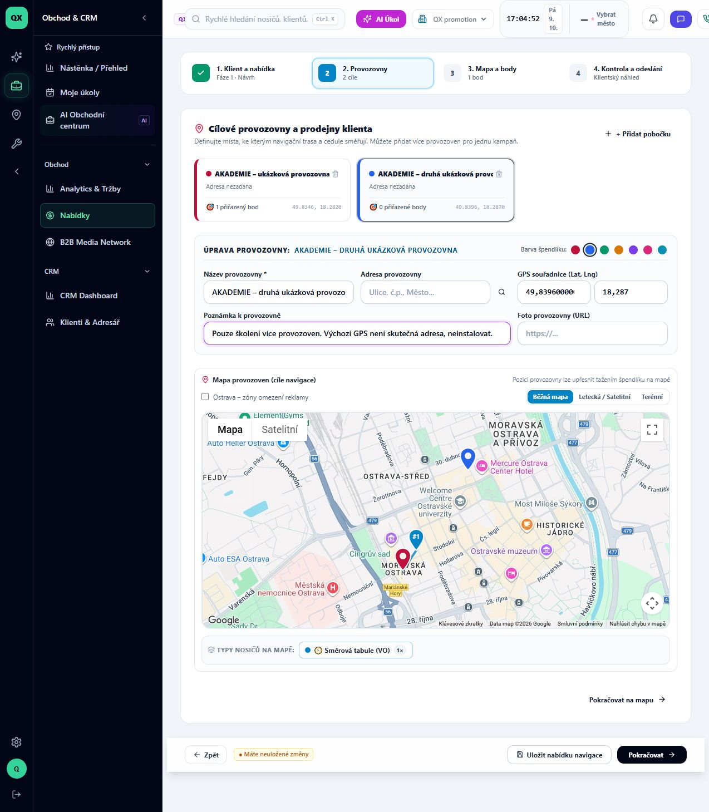
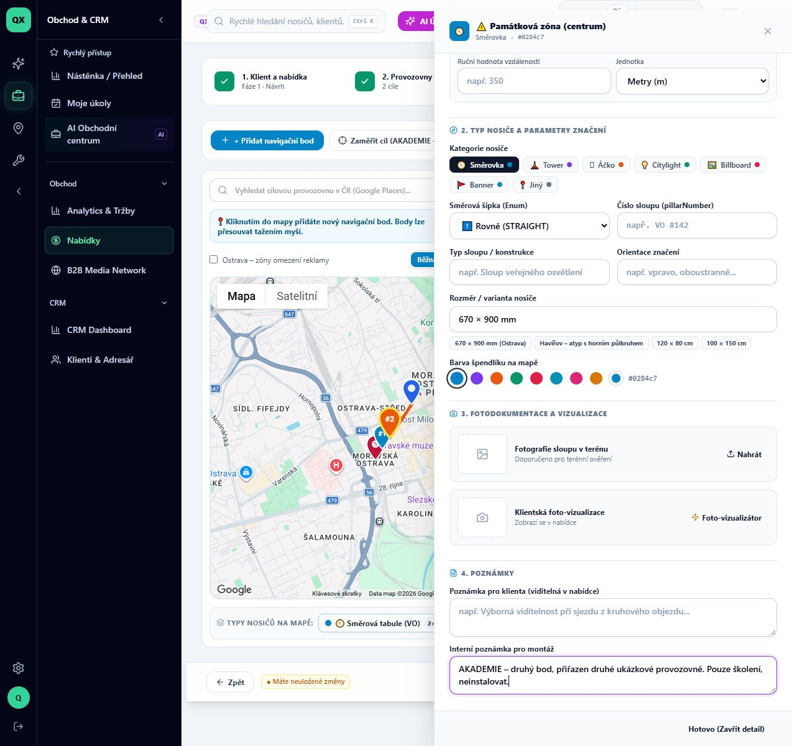
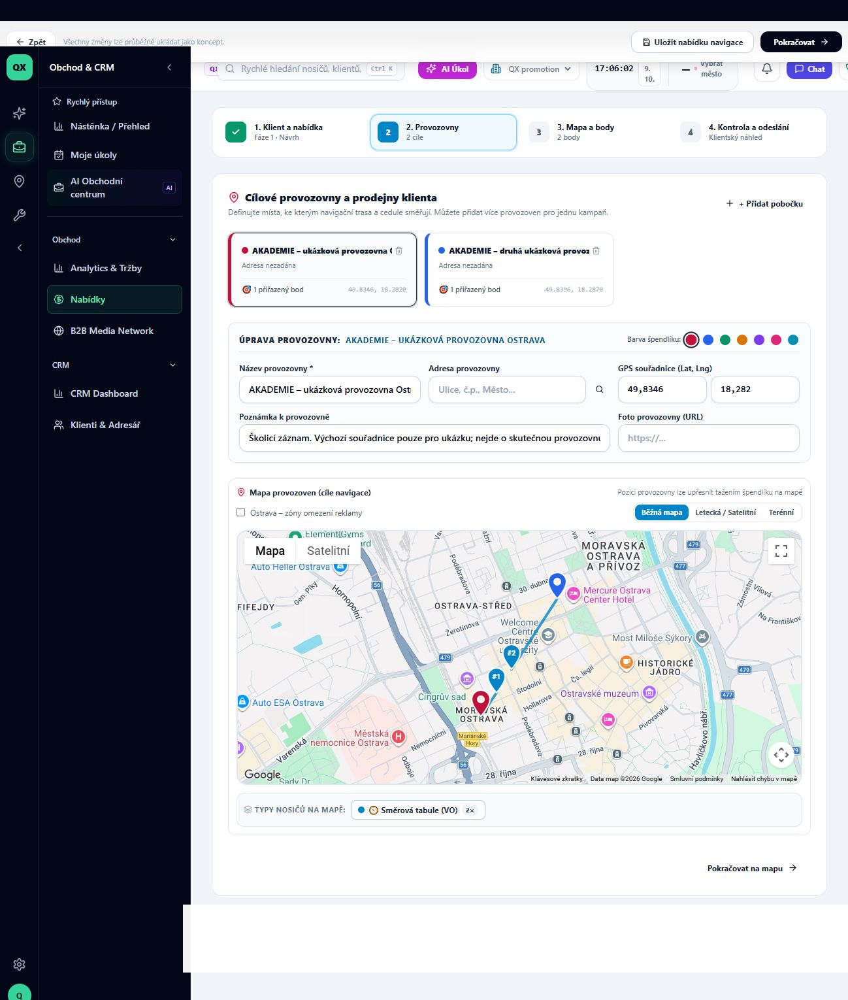

# Jak přidat druhou provozovnu do navigační nabídky

Stav: VERIFIED. Ověřeno 9. 10. 2026 v živé aplikaci, QX promotion, účet TEST QX – audit ADMIN, desktop. Odhad: 3 minuty. Lekce zatím není publikovaná v Akademii.

Předpoklad: uložený lokační koncept s jednou provozovnou a jedním bodem, přístup k jeho úpravám. Navazuje na [první lekci](01-navigacni-koncept.md). Výsledkem budou dvě provozovny, každá s jedním přiřazeným bodem.

## 1. Otevřete úpravu návrhu

V detailu nabídky najděte **Práce s nabídkou** a klikněte na **Upravit lokační návrh (přidat/odebrat body)**. Při ověření se editor otevřel rovnou na kroku **2. Provozovny**. První provozovna měla jeden přiřazený bod.

## 2. Přidejte pobočku

Klikněte na **+ Přidat pobočku**. Objeví se **Prodejna 2** s nulovým počtem bodů. Vyplňte **Název provozovny**; ukázka používá „AKADEMIE – druhá ukázková provozovna“. Pro skutečnou zakázku doplňte adresu a ověřte GPS.

Pozor: aplikace předvyplnila souřadnice poblíž první provozovny. Nejde o vyhledanou adresu druhé pobočky. Ve školení jsou ponechány jako výslovně označená ukázka.

## 3. Přidejte navigační bod

Klikněte na **Pokračovat na mapu**, potom **+ Přidat navigační bod**. Vyčkejte na druhou kartu a počítadlo **2 body**. Na druhé kartě klikněte na **Detail**.

V tomto průchodu se nový bod automaticky přiřadil k první provozovně, přestože jsme právě vyplňovali druhou. Správný cíl proto výslovně nastavte.

## 4. Vyberte cílovou provozovnu

V detailu bodu, v části **1. Umístění a cíl trasy**, otevřete výběr **Cílová provozovna** a zvolte **#2 AKADEMIE – druhá ukázková provozovna**. Při vlastní zakázce vyberte odpovídající skutečnou pobočku. Zkontrolujte polohu bodu a parametry značení. Školicí bod má interní poznámku, že se nemá instalovat.

## 5. Zkontrolujte a uložte

Klikněte na **Hotovo (Zavřít detail)** a potom **Pokračovat**. Souhrn má zobrazovat **2 prodejny** a **2 body**. Klikněte na **Uložit nabídku navigace** a vyčkejte na zprávu **Navigační nabídka byla úspěšně uložena.**

Při této úpravě aplikace zůstala na obrazovce kontroly. Na rozdíl od vytvoření nové nabídky nepřesměrovala na detail. Není potřeba znovu klikat na uložení jen kvůli chybějícímu přesměrování.

## 6. Ověřte výsledek

Obnovte stránku. Editor se v našem průchodu znovu otevřel na provozovnách. Obě provozovny zůstaly uložené a na každé kartě bylo **1 přiřazený bod**. Horní lišta uváděla **2 cíle** a **2 body**. Tím je úkol dokončený.

## Rozsah ověření a údržba

- Použit stejný školicí koncept `/offers/cmv111hh20001l806tfui6j80`; nevznikla další nabídka. Přidána druhá provozovna a druhý bod, jeho cíl výslovně změněn na druhou provozovnu.
- Prokázáno načtení návrhu, přidání pobočky a bodu, změna cíle, potvrzení uložení a zachování obou vazeb po reloadu.
- Neověřeno: klientský výběr, filtrování podle poboček, výpočet jízdních tras, mobilní ovládání, ostatní role a realizace. Nebylo provedeno odesílání ani schvalování.
- Screenshoty jsou původní z aplikace. Souhrn s viditelným přístupovým odkazem klienta nebyl zařazen mezi snímky návodu.
- Před READY zbývá redakční kontrola a zvýraznění ovladačů; před PUBLISHED také chráněná média a publikace v Akademii.
- Po změně editoru provozoven či detailu bodu zopakovat kroky 1–6 na označeném školicím konceptu. Kontrolovat výchozí cíl nového bodu a přiřazení po reloadu. Při změně postupu označit starou verzi OUTDATED, pořídit novou sadu snímků a nepřepisovat původní důkazy.
