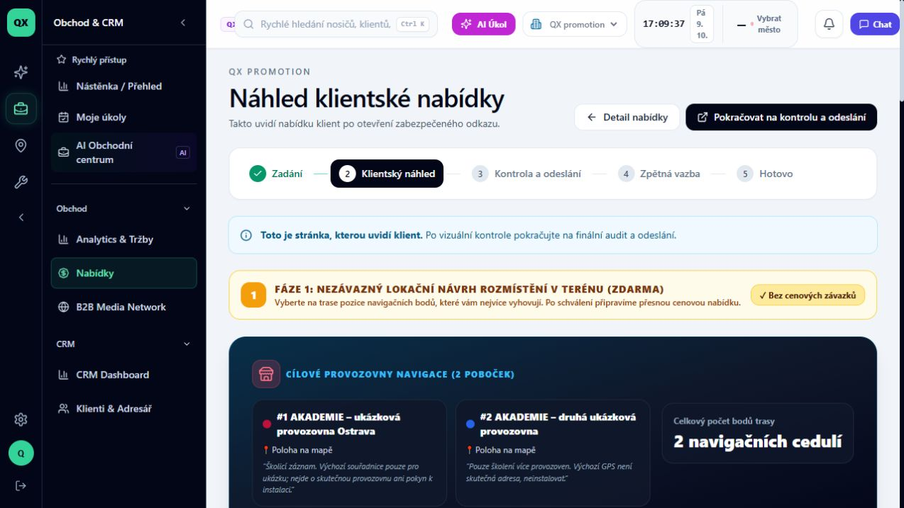
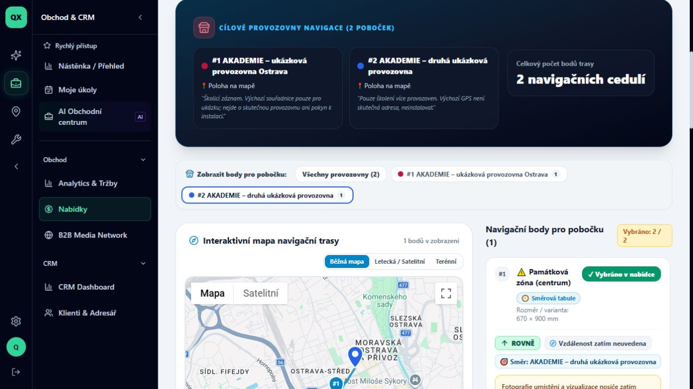

# Jak zkontrolovat klientský náhled a body jednotlivých poboček

Stav: VERIFIED. Ověřeno 9. 10. 2026 v QX promotion, účet TEST QX – audit ADMIN, desktop. Odhad 2 minuty. Zatím nepublikováno v Akademii.

Předpoklad: uložená navigační nabídka se dvěma provozovnami a přiřazenými body podle [druhé lekce](02-vice-provozoven.md). Cílem je zkontrolovat prezentaci a filtr poboček; nejde o potvrzení výběru klientem.

## 1. Otevřete náhled

V detailu nabídky v části **Práce s nabídkou** klikněte na **Zkontrolovat klientský náhled**. Otevře se stránka **Náhled klientské nabídky** s odkazem **Detail nabídky** a lištou obchodního workflow. Tento průchod používá interní náhled přihlášeného uživatele.

## 2. Zkontrolujte provozovny a fázi

U naší ukázky je uvedena **Fáze 1: Nezávazný lokační návrh rozmístění v terénu (ZDARMA)**. Ověřte názvy obou provozoven a jejich poznámky. Počet bodů má být **2 navigačních cedulí**. Názvy a poznámky z editoru jsou zde viditelné i v prezentaci.

## 3. Zobrazte body jedné pobočky

V části **Zobrazit body pro pobočku** klikněte na tlačítko **#2 AKADEMIE – druhá ukázková provozovna 1**. Výsledek: mapa hlásí jeden bod a seznam má nadpis **Navigační body pro pobočku (1)**. Na kartě zkontrolujte **Směr: AKADEMIE – druhá ukázková provozovna**.

Pozor: ve filtrovaném seznamu se druhý bod zobrazil jako **#1**. Pro identifikaci proto používejte také cílovou provozovnu a polohu, nikoli samotné pořadové číslo.

## 4. Rozlište filtr a výběr

Při zobrazení jedné pobočky zůstal údaj **Vybráno: 2 / 2**. Filtr mění zobrazení; v tomto průchodu nezměnil počet vybraných bodů. Nestiskli jsme tlačítka výběru ani **Potvrdit body k nacenění**.

## 5. Obnovte všechny body

Klikněte na **Všechny provozovny (2)**. V seznamu se opět zobrazí dvě karty. Tím je kontrola filtru dokončená. Pro další kontrolu podkladů použijte **Pokračovat na kontrolu a odeslání**, případně se vraťte přes **Detail nabídky**.

## Evidence a omezení

Ověřený interní route: `/offers/cmv111hh20001l806tfui6j80/preview`. Všechny provozovny → 2 karty; druhá pobočka → 1 karta správného cíle; všechny provozovny → opět 2 karty. Fotografie v ukázce chybí a aplikace to výslovně uvádí. Zobrazení fotografií ani chování nepřihlášeného klienta tímto nejsou ověřeny. Nebylo provedeno odeslání, potvrzení výběru ani změna nabídky.

Před READY: redakční kontrola a zvýraznění ovladačů. Před PUBLISHED: chráněná média a publikace v Akademii. Při změně klientského náhledu zopakovat filtr v obou směrech a zkontrolovat počty i názvy cílových provozoven; původní snímky uchovat.
