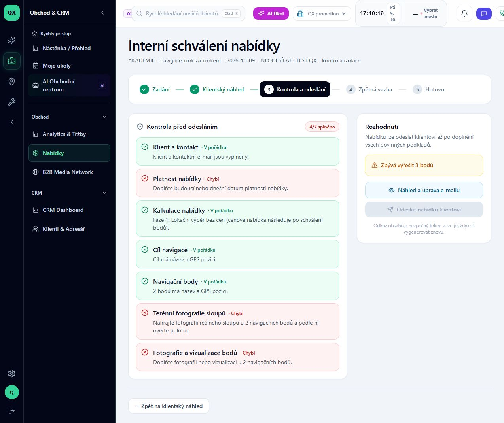

# Jak zjistit, co nabídce chybí před odesláním

Stav: VERIFIED pro kontrolu nedostatků a zakázané odesílací tlačítko. Ověřeno 9. 10. 2026 v QX promotion, účet TEST QX – audit ADMIN, desktop. Odhad 1 minuta. Zatím nepublikováno v Akademii.

Cílem je najít chybějící podklady a vrátit se k jejich doplnění. Tato lekce nedokládá úspěšné odeslání e-mailu.

## 1. Přejděte z náhledu na kontrolu

Na stránce **Náhled klientské nabídky** klikněte na **Pokračovat na kontrolu a odeslání**. Stejný cíl nabízí krok **3 Kontrola a odeslání** v horní liště.

## 2. Přečtěte kontrolní seznam

V části **Kontrola před odesláním** zjistěte, které položky mají stav **Chybí**. U školící nabídky je **4/7 splněno** a chybějí:

- **Platnost nabídky** – aplikace požaduje dnešní nebo budoucí datum.
- **Terénní fotografie sloupů** – chybí reálná fotografie u obou bodů.
- **Fotografie a vizualizace bodů** – chybí klientské vizuály u obou bodů.

## 3. Zkontrolujte možnost odeslání

V části **Rozhodnutí** aplikace uvádí **Zbývá vyřešit 3 bodů** a tlačítko **Odeslat nabídku klientovi** je zakázané. To v tomto průchodu odpovídá chybějícím podkladům. Samotné uložení konceptu neznamená připravenost k odeslání.

## 4. Vraťte se k doplnění

K úpravě vede horní krok **Zadání**; k další prohlídce prezentace odkaz **← Zpět na klientský náhled**. Po doplnění podkladů je potřeba kontrolu zopakovat. Doplnění fotografií a následné odblokování odesílání zatím v této lekci nebylo provedeno ani ověřeno.

## Známá nesrovnalost: kontakt

Položka **Klient a kontakt** v tomto průchodu tvrdila „Klient a kontaktní e-mail jsou vyplněny“, přestože souhrn editoru uváděl „Bez e-mailu“. Kontrola kódu `lib/offers/workflow.ts:33` až 37 ukázala, že lokační fáze 1 může projít kontrolou kontaktu bez e-mailu, ale text úspěchu tento důvod nerozlišuje. Z této zelené položky proto nelze vyvozovat, že je skutečný příjemce e-mailu vyplněný. Před skutečným odesláním příjemce ověřte.

## Evidence a údržba

Route `/offers/cmv111hh20001l806tfui6j80/approval`. Ověřeno zobrazení kontrol a disabled stav tlačítka. Nebylo otevřeno ani odesláno e-mailové podání, nebyly měněny podklady nebo obchodní stav. Nasazený commit není z tohoto průchodu známý; kódová analýza je z aktuálního pracovního stromu.

Před READY: redakční kontrola a zvýraznění ovladačů. Před PUBLISHED: chráněná média a publikace. Po změně `offerReadinessChecks` zopakovat kontrolu na nekompletním konceptu. Pokud se povinné podklady či hlášky změní, starou lekci označit OUTDATED.
