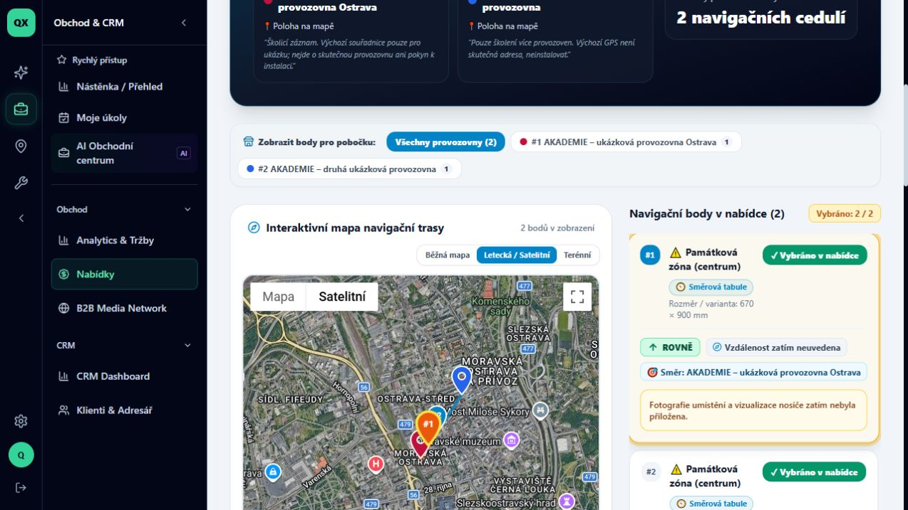
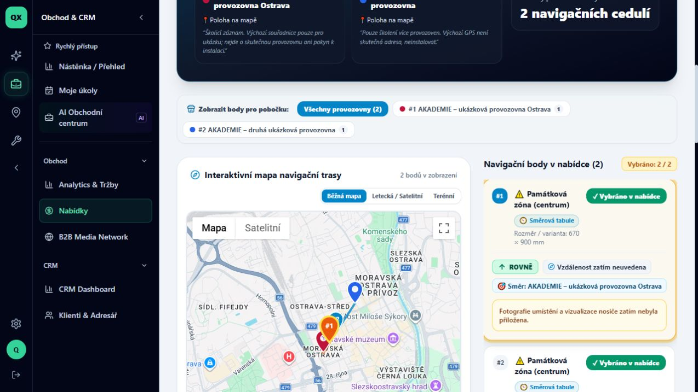

# Jak přepnout mapu při kontrole navigačních bodů

Stav: VERIFIED. Ověřeno 9. 10. 2026 na školicích datech QX promotion, ADMIN, desktop. Délka 1 minuta. Předpoklad: uložená navigační nabídka s body a přístup k Nabídkám.

## 1. Otevřete klientský náhled

Otevřete Nabídky, vyberte svou navigační nabídku a v části Práce s nabídkou použijte **Zkontrolovat klientský náhled**. Posuňte se k mapě. Tento návod používá interní náhled přihlášeného uživatele.

## 2. Zvolte satelitní podklad

Nad mapou klikněte na **Letecká / Satelitní**. Podklad se přepne na snímky okolí. Zkontrolujte umístění bodů vzhledem k budovám a komunikacím. Snímek je orientační podklad; nenahrazuje aktuální kontrolu místa v terénu.

## 3. Vraťte se na běžnou mapu

Klikněte na **Běžná mapa**. Znovu se zobrazí uliční mapa. Přepnutí podkladu nevyžaduje uložení nabídky.

## 4. Zkontrolujte zachování bodů

Pod mapou zkontrolujte karty navigačních bodů. Ve školicí nabídce zůstaly při obou podkladech dvě karty. Přepínáte pouze zobrazení mapy; pro úpravu polohy se vraťte do editoru nabídky. Tlačítko **Potvrdit body k nacenění** není součástí této kontroly.

## Evidence

Ověřeno přepnutí oběma směry, vybraný satelitní i uliční podklad a zachování dvou karet. Bez potvrzení výběru, odeslání nebo změny bodů. Snímky obsahují pouze autorizovaná školicí data.
