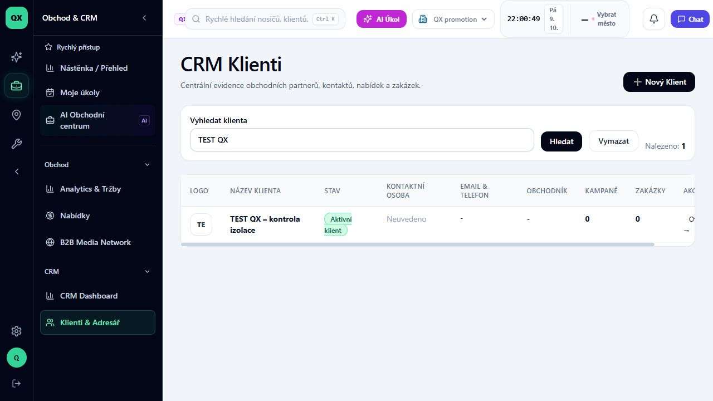

# Jak vyhledat klienta v adresáři

Stav: VERIFIED. Ověřeno 9. 10. 2026 na školicích datech QX promotion, ADMIN, desktop. Délka 1 minuta. Předpoklad: přístup k CRM a existující klient ve vaší organizaci.

## 1. Otevřete adresář

V levé navigaci otevřete **Obchod & CRM**, potom **Klienti & Adresář**. Stránka má nadpis **CRM Klienti**. Pracujete v aktuálně zvolené organizaci; její název je vidět v horní části aplikace.

## 2. Zadejte hledaný název

Do pole **Vyhledat klienta** napište část názvu klienta, kterého hledáte. V ukázce používáme **TEST QX**. Použijte název vlastního klienta; školicí klient z obrázku ve vaší organizaci být nemusí.

## 3. Spusťte hledání

Klikněte na **Hledat**. Nad tabulkou zkontrolujte údaj **Nalezeno**. V ověřené ukázce se seznam zúžil na jeden výsledek **TEST QX – kontrola izolace**.

## 4. Ověřte správný výsledek

Porovnejte název a dostupné kontaktní údaje v řádku. Prázdný údaj neznamená chybu hledání: školicí klient například nemá vyplněnou kontaktní osobu. Pokud klienta nenajdete, zkontrolujte pravopis a aktivní organizaci, než založíte nový záznam. Tato lekce končí nalezením klienta v seznamu.

## Evidence

Ověřena cesta z navigace, zadání názvu a hledání s výsledkem jedné odpovídající položky. Otevření detailu není součástí ověřeného výsledku. Snímek neobsahuje reálné kontaktní údaje.
